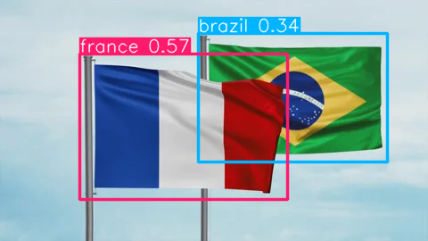
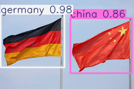

<h1>FlagSense</h1>

<p align="center">
  
</p>

FlagSense is a Python package for detecting and classifying flags in images. Using advanced computer vision techniques, FlagSense identifies national flags and determines which country they belong to. FlagSense uses state-of-the-art models to detect flags in real-world contexts and accurately classify them by country. 

<h2>Installation</h2>

FlagSense can be easily installed via pip:
```pip install flagsense```

<h2>Usage</h2>

After installation, FlagSense can be easily used in the command line by running the following code, where input_path is a filepath to an image or a folder containing many images on a local machine.

```flagsense input_path```

The --model flag allows the user to choose from a list of models included in the package. The default model (if no value is input) is a custom YOLOv8 model trained on all nation flags. The user can choose additional models if they prefer, or can choose continent-specific models. Continent specific models are useful in situations where the user may know the location of an image and thus expect certain nation flags, or is only interested in classifying flags of a certain continent. A list of models and the flags to call them is below:

* v8 - YOLOv8, all countries
* v9 - YOLOv9, all countries
* v10 - YOLOv10, all countries

By default, FlagSense outputs annotations in both YOLO and COCO JSON format. By adding the flag “verbose”, the model can also output each image overlaid with the annotation. This is off by default since, with a large dataset, creating an additional image for each input image may increase runtime and take up storage.

```flagsense input_path –verbose```

<p align="left">
  
  
</p>

<h2>Interpreting/Exporting Output (Format)</h2>

<h2>Supported Countries and Flags</h2>

<h2>Description of Training</h2>

<h2>License</h2>
DeepFace is licensed under the MIT License - see LICENSE for more details.
